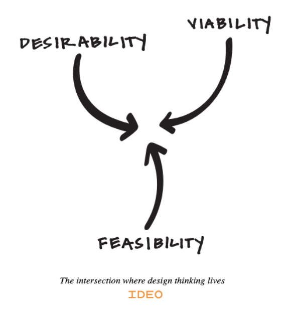

**Welcome to the wonderful world of Design Thinking!**

This sprint will take you through the 5 step process of Design Thinking to assist you in being able to **Think, Do and Create.**

Design Thinking is a term that is used broadly to describe an iterative process to collaboratively solve problems that people, customers or users experience.  It is sometimes referred to as user or human-centred design (HCD), to emphasise the focus on the ‘human user’. There are a lot of new words which we’ll be touching on, there’s a **TERMINOLOGY** topic card to help you familiarise yourself with all the new words during this sprint.

Before embarking on your challenge, it’s important you understand Design Thinking from your own perspective and within your own contexts. 

Design thinking can be noticed in our everyday lives as we navigate uncertainty through common sense creative problem solving. This Sprint will take you through each step of the process to solve a problem in your own context. You will be applying the information that you learn to do that.

We believe Design Thinking is a skill that can be actively practised and improved upon so that we can address issues and solve problems for others, as well as ourselves. 

## WHAT TO EXPECT AND HOW IT WORKS

As part of the Design Sprint, you will complete a series of topics which will help you learn all about Design Thinking. After each topic you will complete a project that relates to the step of the Design Thinking process covered. 

**IN ORDER TO COMPLETE THE TASK YOU NEED TO HAVE READ THROUGH THE TOPIC CARD AND BE SURE YOU UNDERSTAND THE STEP COVERED.**

By the end of the sprint you will have used the Design Thinking process to understand the user, challenge assumptions, and redefine the problem in an attempt to identify alternative strategies and solutions for you and your community.

If you’re wondering…

## “…WHY AM I LEARNING THIS?” 
We can assure you, there is a method to this madness! 

In 2014, an organisation called Intercorp remodelled their entire schooling system using Design Thinking - and the results were astounding. Where before they had 5 schools that were struggling to scale, they now have 63 schools in Peru that support more than 50 000 learners. (We can only imagine the growth, 9 years later) - and each learner doesn’t pay more than roughly $100 a month for the education. The initiative addresses the needs of middle-lower class Peruvian people, all thanks to spending a bit of time understanding the user and their needs. 

Read more about the initiative [here](https://www.ideo.com/case-study/designing-a-school-system-from-the-ground-up).

At Umuzi we start our programmes with a sprint in Design Thinking because we understand the immense value it has, as a foundation for beginning to learn a new skill (or even expand on an old one!). Pair this problem solving framework with the skills and experience you’ll acquire in your course/upskilling - and there is nothing stopping you from going out into the world and doing amazing things. Keep that in mind throughout this sprint, soak in all the knowledge, do some research and let’s do this thing. 

## WHAT YOU WILL BE DOING?
In this sprint challenge you will be required to build a product or service **e.g a mobile app.** This will form part of the solution to the problem(s) you have been given at the start of the sprint. 

**Using each phase of the Design Thinking process, solve the problem from your own and your community's context to improve or make your lives better!**

The solution can be in the form of a digital application.

