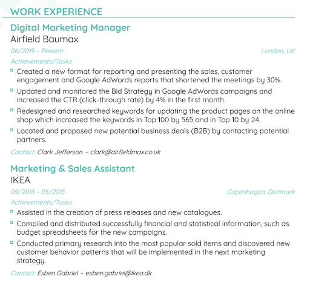
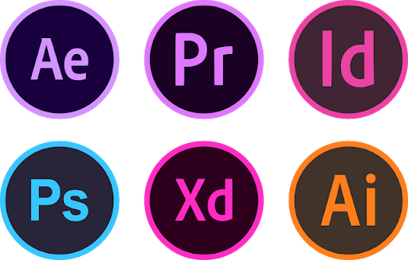
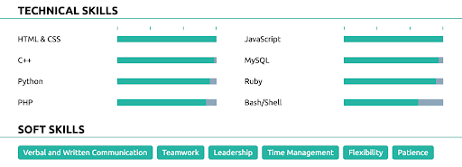

# WHAT IS A CV?

A CV is a great way to present all the ‘professional facts’ about who you are while providing insight to potential employers as to how you might integrate effectively into their team. 

There are some standardised components to a CV which you will be required to compile before you personalise it. You are also able to add anything you think is relevant to your field in order to ensure that you stand out. Creating your first CV is an opportunity to start creating a brand for yourself, to consider your entire digital presence, and to think about where you want to work.

It is also a great opportunity to review all the content you have created online and decide whether or not it is suitable for a potential employer. 

## Do's + Don’ts

### Do These Things
- Keep it to one page
- Include your contact details
- Mostly stick to chronological order
- Send it as a PDF
- Tell a story (career path/education) – start with the most recent 
- Proofread! Get others to proofread it too 
- Create hyperlinks for portfolio pieces
- Layout – keep it simple, clean, and easy to navigate
- Don’t waste white space
- Column layout
- Use icons for visual impact
- List useful things you’ve done as follows: [This useful thing you did] had this [real and measurable business impact]. To achieve this I used [list of very specific skills used/tools applied] 

### Try and avoid doing the following
- Don’t use colourful or glossy paper and hard to read fonts
- No spelling or grammar errors (tenses!)
- Don’t include a photograph of yourself
- Don’t include age/gender
- Don’t include the status of your health
- Don’t include your marital status
- Don’t include your religion
- Don’t include references
- Don’t use abbreviations and jargon 
- Don’t include current or expected salary
- Don’t list everything you’ve ever done
- Never ever claim someone else’s work as your own

## What To Include In Your CV
1. Contact information
2. Your personal statement
3. Experience
4. Education
5. Skills
6. Portfolio links (if applicable)
7. Achievements/Awards
8. Social media presence

### 1. Contact information
Your contact information is used for your potential employer to get hold of  you. You should include your name, phone number, and e-mail address. During the hiring process, employers use the contact information to provide you with updates about your job application, including getting in touch to schedule initial interviews and filling out paperwork regarding your pending employment.
- Include your full name (in bold and slightly larger font) at the top of your CV. It is a professional document about you, so consider your name a heading.  
- Include your e-mail address under your name
- After that, add your phone number

### 2. Your Personal Statement
Your personal statement should give your prospective employer a sense of who you are and what drives you. It needs to encapsulate your work ethic, career goals, and work philosophy. In simple English, your personal statement is about what you do, your career ambitions, and what drives you in your craft.

**Example**

"I am a **committed and hard-working individual** who **enjoys a challenge**. In addition to **strong communication skills**, I am **able to work effectively in a team**. I can also demonstrate **advanced problem-solving skills** and **thrive under pressure**. My **drive and ambition** ensure I am a valuable addition to any company.”

👆This is a terrible example of a personal statement!!!

Why?

Because it is filled with buzzwords that are not a true reflection of who you are or unique to you. This is a sure way to make your CV blend into the sea of CVs. You want yours to stand out and catch the attention of the reader. It needs to be authentic and a true reflection of who you are. 

Your personal statement is the packaging of your **values, goals, and experience** in a way that shows what unique solutions you can offer an employer.
- Professional values
- Professional goals and aspirations
- Past experience in relation to your goals and values

***Here are a few good examples of what your personal statement should look like***

*“Nyiko is a naturally analytical researcher who communicates complex information using simple and clear data visualisation. Being a Data Scientist, he provides insights into complex business problems that may arise in the ever-changing tech world. He is looking to offer his communication skills to an innovative, groundbreaking team working on cutting-edge products driven by data.”*

*“From a full-time musician to a self-taught full-stack developer, Lwandile spends hours on his computer constantly upskilling in code. He prefers working in teams as he believes that it is through collaboration that understanding is developed, communication built, and knowledge is gained. He teaches and shares as much as he learns, and desires to work with others who are also driven to achieve their goals.”*

*“Ntombi is an inquisitive UX Strategist who loves all things data and research. As an anthropology graduate, she believes that through research that is timely, relevant, and accurate, any problem can be solved. The blending of Strategy and Anthropology has created an innovative problem solver with a strong focus on human-centred design thinking in her strategies.”*

*“Karabo is a Digital User Interface and Graphic Designer obsessed with line illustrations and designs. She is fascinated by art direction and the use of minimalism to design. Ideas around how design can improve the way that people perceive brands, advertising, and marketing add fuel to Karabo’s passion for what she does. Her ultimate goal is to live her best creative life, doing yoga, painting, and being a brand genius.”*

*“Web Developer with experience in coding interactive websites and mobile apps for the startup world with a number of remote teams. I enjoy the fast-paced environment of the tech industry and being part of pioneering teams.”*

*“Having worked as a UI designer for a few years in an agency organising major campaigns and designing for multinational clients, I’m looking to offer my strong leadership skills to an innovative team working on cutting-edge design.”*

### 3. Experience
Your CV is a great opportunity to show what experience you’ve already gained working in different roles. 

Suggested format:
- Job title and position
- Company name/description/location
- Dates employed
- Responsibilities and achievements

It could look like this:



### 4. Education
This is an opportunity to indicate what education you have completed up to this point. It is worth noting the format and layout of this, and to try and keep it consistent. Many explorers will check nationally recognised qualifications, but adding short courses and certificates is also valuable. 

You can include the following types of education:
- School leaving
- Higher education
- Short courses

**School Leaving Example:**

```
Sandringham High School
2015
Matric (GED)
Subjects: Maths (a), English (B), Zulu (C), Geography (D), History (E), Lufe Orientation (A)
```

**Higher Education Example:**

```
Umuzi
May 2021 - Present
National Certificate in Information Technology (System Development) (SAQA ID 48872)
```

**Short Courses Example:**

```
2017
Grow with Google: User Experience Design
```

### 5. Skills
Presenting your skills visually is a great way to show what knowledge and skills you have. You can use icons to do this in a really easy way. You can present a range of different skills – some could be more technical than others.






### 6. Portfolio Links
Refer to the Portfolio of Work section for more information on this.


### 7. Achievements or Awards
Having awards and accomplishments on your CV is one of the ways you can make your application stand out. Awards can help demonstrate soft skills like teamwork, creativity, and problem-solving abilities, and are also great to include if you have little work experience and need to prove your abilities on an entry-level CV. Consider the significance of each of your achievements. Only include awards relevant to your current career goals and job search. For example, you would only list an award for playing the piano if you were applying for a job playing or teaching piano.


### 8. Social Media Presence
This can be a difficult thing to include in a  CV, but it is really helpful for potential employers to see how you present yourself online – remember that organisations often do a ‘social media check’ before offering you a contract. It is important to be mindful of what you post because of this – consider using different accounts for personal and professional purposes. 

It is a great space to assist in developing and turning yourself into a brand, one that any organisation would be lucky to work with!

## Some Additional CV Tips + Tricks
### *Be Instantly Impressive*
Assume that you’ll only have 30 seconds to impress on the first pass, so: 
- It needs to look and feel beautiful! 
- The two or three most impressive things need to “land” within a quick glance. Find a way to emphasise them so that they do! 

Using professionally designed templates will go a long way towards making it look and feel beautiful. We can’t all be amazing designers, but we can all leverage amazing design work that others have already done. (More on this in the exercises.) 

### *Get Lots Of Feedback From The Right People*
People want to help people who are busy helping themselves. Leverage your networks in the industry (perhaps some you met in section two of this sprint) to get advice on how to improve your CV. 

If you don’t yet have networks in the industry, remember that a good proportion of strangers would likely be willing to help with this. In the words of Steve Jobs: 
“I’ve never found anybody that didn’t want to help me if I asked them for help.” 
This two minute video might just change your life!

Try and get feedback from both of these: 
- People who do the hiring. They’ve likely been through the process many, many times and can abstract the best dos and don’ts. 
- People who have been repeatedly successful in getting hired. They might know some things about what actually works that the recruiters aren’t even aware of. 

### Avoid CV Padding
Landing your first job is ridiculously hard. One of the biggest reasons for this is that there are many juniors who think it’s ok to pad their CVs with claims that aren’t quite true. 

For example, there are many junior devs who would, for example, do the React basic tutorial and then put React on their CV as though they have actual skills. Doing tutorials and pursuing learning is great, but you should never put anything misleading on your CV. Don’t claim you have skills when you only have introductory knowledge!

**Here is how resume-padding hurts all junior developers:**
If a company wants to hire a junior developer t, thousands of unqualified people will apply. Many of those people would have padded their CVs by claiming to know things they don’t know.  Companies know this, and there are a few different ways they handle it:

1. Some companies look for very specific credibility indicators on the CVs they receive. For example, they might look for the names of universities. This puts self-taught coders at a huge disadvantage. 

2. Some big companies build their own talent pipelines, e.g. BBD, a prominent development house in South Africa, gets Umuzi to train developers for them. Umuzi provides devs so BBD doesn’t need to go through the pain of looking for junior tech talent themselves.

3. And lastly, some companies just think it’s way too risky to hire junior devs and way too expensive to hire seniors. Those companies never meet their full potential.

[This conversation](https://news.ycombinator.com/item?id=28890910) is worth reading.
 
**This applies to many other skills and disciplines and should be avoided no matter what position you are applying for.**

### What Is A Person To Do?
Firstly, be honest in your CV. That’s the most important thing. Don’t contribute to the problem.

You need to find other ways to stand out from the crowd. You need other credibility indicators. And you need to connect with people.

1. **Build up a solid portfolio.** If you are passionate about coding, this should be fun. Build stuff and share your work – if you are passionate about UI, take on personal UI projects that showcase your skills. 
2. **Get real work experience by volunteering.** There are many charitable organisations that can do with an extra brain – find people with real problems and try to solve them. 
3. **Build connections.** Attend tech and other meetups and conferences and take part. Many meetups let members take the stage and show off their work. If you go to these and try to add value, good things will happen for you. Sometimes it’s not what you know, it’s who you know. 
4. **Think what people want or need to see in your CV**
      - For example:
        - Web Dev and Data Science - Set up your portfolio to show your skills and abilities in a way that is easy to navigate and will make a potential employer WANT to HIRE you. Make your technical skills and problem-solving ability CLEAR. 
        - Strategy - Potential employers want to see your thinking- and problem-solving abilities.

## More Resources + Examples
 - [Harvard University: Resume and Cover Letters](https://hwpi.harvard.edu/files/ocs/files/hes-resume-cover-letter-guide.pdf)
 - [Tips to stand out with your CV - Blog CareerJunction](https://www.careerjunction.co.za/blog/top-cv-tips-cv-template/) 
 - [Skills to Put on Resume (List of Good Examples for All Jobs)](https://zety.com/blog/what-skills-to-put-on-a-resume)
 - [Hiration: How to Write a Resume](https://www.hiration.com/blog/how-to-write-a-resume/)
 - [Work Experience on a Resume - How to List It Right](https://novoresume.com/career-blog/how-to-list-work-experience-on-a-resume)
 - [How to Make a Resume in 2022 | Beginner's Guide](https://novoresume.com/career-blog/how-to-write-a-resume-guide)
 - [How To List Awards on Your Resume in 6 Steps (With Examples) | Indeed.com](https://www.indeed.com/career-advice/resumes-cover-letters/resume-awards-example)
 - [Building a Data Science Portfolio](https://www.dataquest.io/blog/build-a-data-science-portfolio/)
 - [Web Developer Portfolios to inspire you](https://medium.freecodecamp.org/15-web-developer-portfolios-to-inspire-you-137fb1743cae)

One of our Umuzi Alumni who has a really awesome online presence - [Kgomotso Neto](http://kgomotsoneto.com/) - [Kgomotso Behance](https://www.behance.net/kgomotsoneto) - [Kgomotso - Instagram](https://www.instagram.com/kgomotso_neto/?hl=en)
