## DESCRIPTION

In this final module we will cover the two last stages of the Design Thinking process which are Prototype and Test. 

The fourth stage in the Design Thinking process is all about experimentation and turning ideas into tangible products. A prototype is a scaled-down version of the product which incorporates the potential solutions identified in the previous stages. This step is key in putting each solution to the test and highlighting any constraints and flaws.

After prototyping comes user testing, but it’s important to note that this is rarely the end of the Design Thinking process. In reality, the results of the testing phase will often lead you back to a previous step, providing the insights you need to redefine the original problem statement or to come up with new ideas you hadn’t thought of before.

## LEARNING OUTCOMES:

By the end of this module you will be developed the following skills:

  - Understand  prototyping and its benefits
  
  - Methods of prototyping
  
  - Understand testing 

In addition to these skills you will also learn:

  - How to conduct testing

  - How to document the testing results 

## INTRODUCTION

By this point, you’ve learned how to talk to your users and client to help understand their needs and objectives, how to frame the problem they face appropriately and how to devise solutions around that problem. Now, you will learn how to build a working model of your idea and how to test that idea with your users/client.
Simply put, prototyping is a sample or example of how the final solution will work. It’s a mock-version of the final solution which we use to help find issues or areas for improvement before we go ahead and build/execute the final solution. The general idea is that by testing out a pre-final version, we can avoid issues that would otherwise only arise once the final solution is implemented, and at that point it’s very difficult to make changes.

### PROTOTYPING OVERVIEW

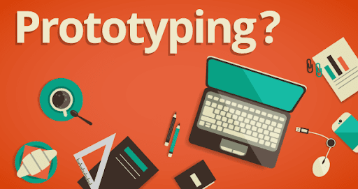

So we know why we need to prototype - it’s to test out our idea before we go ahead with the final solution. The main objective is to find any problems with our current idea’s design and execution so that we can optimize and improve the idea for its final release to the public.

If we go back to Jo from the previous section, we ideated around how we could help him reach his preferred floor in the elevator without the need for an umbrella. If we imagine that the proposed/chosen solution was to create a small foldable ladder for him to use when he gets in the lift, before we go and build the perfect version of the ladder - or send him the final version-, we need to create some simple low-cost versions for Jo to test out.

What we might find is that our ladder is too big and Jo won’t be able to carry it. Or we may find that he does not want to use a ladder because it makes him feel silly and he doesn’t want to draw any more attention to himself, or perhaps he loves the idea but he wants the ladder to be lighter so he can carry it easier.

The takeaway is that we would only know this feedback from Jo once he interacts with the idea/solution. We build a simple version for him to try out so that we can get his user feedback, which allows us to improve the solution for him and create exactly what he needs and what will benefit him the most.

Let’s imagine prototyping from Apple’s perspective. Imagine if Apple created a new type of cell phone and just launched it straight to the public, only to find out that people hate it because the case is too slippery. Seeing as they’ve just shipped hundreds of thousands of the phone globally, it is almost impossible for Apple to fix the phone now that it is in the public. What Apple would have done would be to take the phone and give it to a test group of its users. Very quickly they would have gotten the feedback that the phone is too slippery and they can fix it before they release the final version to the public.

In both examples, we are trying to avoid creating something that is suboptimal for our users. We all want to create products that people love and want to use, but we can’t assume that we know exactly how the product - or service - should look, feel and operate. We have to engage with our users while we build the solution to help guide us; we want to create useful solutions for our users, which means we need to know what they think is useful.

Just like we want to solve for the correct problem and we go about empathising with our users to find out their exact pains, we also need to create the correct solution for the users, which means we must prototype and test with them.

Let’s look at some of the main points about prototyping:

   - It is an inexpensive version of the idea

   - It is a simplified or scaled-down version of the final idea.

   - Its aim is to reveal areas to improve or adjust.

   - We want to test the usability and practically of an idea

   - We want to know how our users think and feel about the solution.

  - It can lead us to new or different solutions that are even better than our chosen idea.

  - We take the feedback from the users and use it to improve or refine the solution.

  - We are trying to avoid costly mistakes from occurring by testing first.

  - It can be a very simple version of the idea, or it can be highly complex

   - The more complex, the more time and effort is spent in creating it, which might mean more time and effort wasted if we find our solution isn’t appropriate as it is.

 - We can focus on certain parts of the idea; we don’t need to create the entire solution as a prototype, we can hone in on a certain component and test that specifically.

  - Imagine if we just tested out the material with Jo before building the stairs - he may inform us that he hates the look and feel of wood and metal and prefers plastic. This already helps us avoid wasting time on creating mockups with those materials.

  - We ideally want to run through several rounds of prototyping; the more we test and improve, the closer our final product/service will be to what people want.

  - We must include the whole team from our ideation phase when designing, building, and testing the prototype.
  
  - We prototype to have something tangible to use when explaining the idea and  showcasing it to stakeholders.

You may hear of the term “rapid prototyping”. What this means is that you are building and testing prototypes quickly and iteratively. You come up with the first one, you test it, you come back to the drawing board with your feedback and new insights, and you build and test again. You run through this cycle several times until you have found a version of the idea that is feasible and viable for your client and user. In rapid prototyping, you can also have different team members working on different prototypes so that you can build and test multiple options of the idea at the same time; this approach is also useful for testing various parts of the solution - some team members could build one component to test and the rest of the team another component.

Take a quick watch of [this video](https://vimeo.com/78645037) to understand rapid prototyping further.

“The reason for prototyping is experimentation—the act of creating forces you to ask questions and make choices. It also gives you something you can show and talk about with other people. … a prototype is just an embodiment of your idea. It could be a skit in which you act out a service experience, such as visiting the emergency room at a hospital.” - Tom and David Kelley

Take a look at [this video](https://youtu.be/kI-CyvHeNNQ) of a prototyping session in action.

## METHODS OF PROTOTYPING

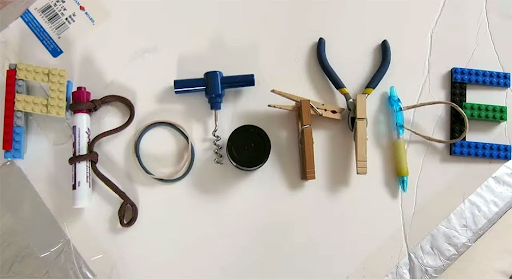

Before we get into this, let’s watch [this video](https://youtu.be/ZzN4jQqXiOU) which briefly explains the types of prototypes.

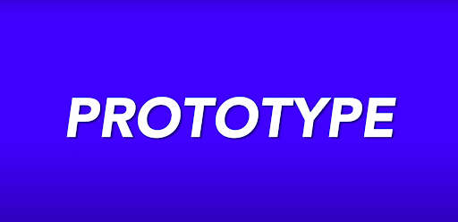

Watch [this video](https://youtu.be/NXLKgUgr6qI) as well which summarises briefly what prototyping is, and talks about 3 methods to prototype. (Watch up until 2 minutes; the remainder goes into a specific example that you don’t need to watch)

There are various methods for prototyping, and depending on your solution’s focus - be it software or hardware - you will need to choose an appropriate prototyping method. If you are building a new website, you’ll likely create wireframes to test out your idea, however, if you are building a new type of stepladder, you may want to create a physical mock-up of the ladder that someone can actually use.

The type of method you choose to use is up to you, and you may even want to use more than one method to ensure you get the most amount and the most meaningful feedback from your user testing. If you only stick to one, you are limiting the feedback you could be getting.

We aren’t going to be recommending a certain method here, as each has its merits; it is up to you and your team to decide how you would like to prototype.

First, let's look at the fidelity of a prototype before we engage with the methods.

### HIGH VS LOW FIDELITY

The first thing to discuss is the fidelity of your prototype. Fidelity refers to the accuracy or exactness of something. So for prototyping, low fidelity means that the prototype does not closely represent the exactness of the final solution; this could mean that the prototype is highly simplified, or we are only looking at one part of the solution. High fidelity on the other hand means that the prototype very closely resembles the intended final product; if we are building a mobile application, the high-fidelity prototype will include pictures, colours, and working buttons, as opposed to low-fidelity which would just be a hand-drawn black/white mock-up without working buttons. With the high-fidelity prototype, we are creating something very close to the final product; we use tools like 3D models with physical moving parts to showcase the product and allow for physical user testing.

Using low-fidelity prototypes is useful as it allows the team to either test basic concepts or specific parts of the solution; we can test out parts of the solution that concern us or require special attention. It is also useful as we can avoid wasting time or resources on a high-fidelity version which could have many problems that require fixing. Building low-fidelity versions can also allow us to use cheaper materials in the prototyping phase which helps with budgeting issues.

The correct way to do it would be to create multiple low-fidelity versions first which will help with finding all the major bugs and issues with your solution and then, only once you are confident that your solution has taken onboard all the feedback, you can create and release a high-fidelity version for final testing.

### METHODS

As mentioned above, there are several types of prototyping methods. The list below goes over the most common. Some may be completely irrelevant to your needs; you may be designing for a new website, in which case you wouldn’t be building a physical mock-up because the product you are designing is software and is intangible.

**Let’s take a look at each before we dive into a couple.**

***Film/Movie***

This method involves creating a video which indicates to other people how the idea might work by using motion-graphics and/or audio.

The idea is to speak to your users and explain to them how the process might work and what steps are involved. By seeing visuals and hearing someone explain it, the user can have a good understanding of the product/service you are designing for.

***Rapid Prototyping***

The method here dictates that multiple rounds of prototypes are created to incrementally test the validity of certain decisions or features. One could start with low-fidelity versions and end on high versions.

***Simulations***

The idea here is to create a mock-up of the solution that is then run through a simulation machine which mimics the real world. So instead of testing on real users, the solution is run through a generic real-world situation. If it cannot pass the normal real-world situation, then it is unlikely to pass a specific user test.

The example here could be a flight simulation game. The idea is that before a big company like Boeing goes and creates a new airplane, they can create a digital version first that can get run on a simulation so that they can test the reliability and performance of the new aircraft.

***Storyboard***

This method prescribes that you draw out the solution as a story. Imagine you are creating a comic strip, where each block is a different phase/stage of the solution. By laying out the process or journey that the user would go on when engaging with the product, we can take them through it and get real feedback on where they think they might have issues or where we can improve.

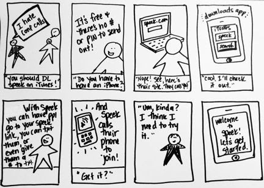

***Sketching***

This method is the most basic version of wireframing. It entails using a pen and paper to draw out your potential solution.

This can be used for both digital and non-digital solutions.

This is usually done as a precursor to wireframing which we discuss next. Wireframing generally, but not always, involves using software to build a skeleton of the idea, and if we sketch first we can simply replicate the solution using a wireframing tool.

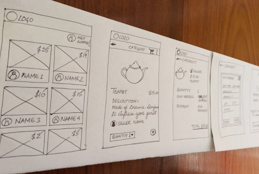

***Wireframes***

A wireframe is a hand-drawn or digitally rendered basic version of your solution.

This method is mainly used when designing digital solutions such as websites or mobile applications.

The idea here is that we draw out the skeleton of the page or app; we do not focus on any non-functional elements like the colour or the font of the page, but rather the functional elements like navigational items, a live chat feature, or a help window.

This method allows us to ensure that the idea works from a functional perspective. Once we are confident that the solution works, we can then worry about the exact look and feel of it. The focus is on function first, then form.

There is no set rule to using wireframing software or using a pen and paper. The idea is that you don’t want to waste any time, so avoid using software if there is a steep learning curve. There are tons of digital tools, such as InVision and Axure.

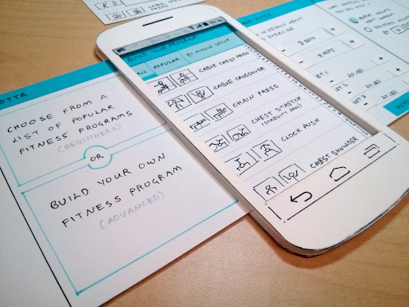

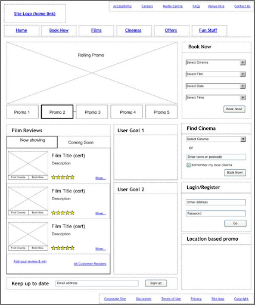

***Mock-ups***

This is very similar to wireframes, however, we are inversing what we look at. Instead of looking at the functional elements, we are looking at the non-functional.

We want to have a view of the look and feel of the page or product we are designing. How do we expect its style and design to look? We are not concerned with how it is going to work, but rather what it is going to look like.

We generally do mock-ups after we have done wireframing and have bedded down where all the functional elements will be, and now we want to see how that may look.

With mock-ups, we are very close to what the final product may look like. If you are building websites and you use a tool like InVision, you can actually link your various pages together with real clickable buttons. This allows you to give your user a very close look at the potential product and how it would be used.

Here is an example of a [clickable mockup](https://marvelapp.com/29a9gjj/screen/32324245). (Note that this is not a working website; these are simply images that have been linked to each other and made into a mock process; also, only certain parts of the image are clickable).

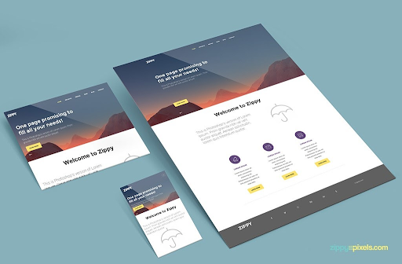

***Sketch vs Wireframe vs Mockup:***

Below shows the progression of an idea from sketch, to wireframe, to mockup.

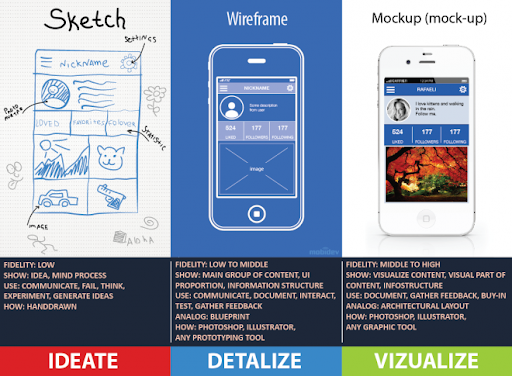

***Document Prototype Process***

When prototyping, you should ensure to capture all collateral that is developed during the process. This includes any low-fidelity prototypes that you come up with on your way to your high-fidelity versions. Capture all sketches that you may do and any wireframes that are created as well. Equally as important is any feedback that may have been captured along the way. If any small testing has been done, or if any feedback from stakeholders or the client has been gathered, then that too must be documented appropriately.

It’s important to do this so that we have a good track-record of the decisions we made during our prototyping. It can be a record of any pivots we have made or any changes that occured. We can also ensure that we are documenting any decisions that are to affect things later in the project. Perhaps we find that there are decisions or processes that must occur during the execution of the idea that impact other departments in the company - we must document these to ensure we don’t forget about them.

You can attach all this information to the client pitch document you created in the ideation phase.

TEST OVERVIEW

In this phase, we are going to look at how we test our prototypes with our users. This is a crucial phase of the process, as this is the time where we learn if our solution is actually going to work for whom we are designing. Our testing in this phase will either confirm that our solution is appropriate and does actually work for our users, or indicate that it needs to be redesigned or engineered to satisfy the user better; we may even learn that our solution won’t work at all and we need to head back to one of the previous stages.

**Always Test!**

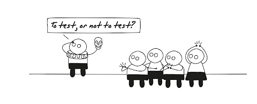

Note: in the assignment questions attached to this section, we refer to ‘troubleshooting’ the problems. This simply means testing the solution with your users and engaging the users such that you can collect their data and their responses to understand the why of the problem they have with the solution. This section will help explain how to do this.

### THE USER
Ensure that you are working with the correct users. We spoke in a previous section about ‘extreme users’ which is the idea that most of your users will fit into the ‘average’ user, however you will have users who are not part of the norm. You must make sure to engage with extreme users in this testing phase to check that your solution works for both the average user and the outlying user.
What you should ideally do is go back to the personas which you developed previously and find users who fit those persona types. You would want to get around 5 users per persona type for initial testing. There is no prescribed number of users to test on, however the more user feedback you have the better - you just need to be very conscious of time and resources as you do not want to get stuck in the testing phase for too long.

Additionally, you may want to garner feedback from your key stakeholders as well. If you have different departments involved in the solution, then you should get those people to test it out too.
Make sure that you document the type of user the user is when you are documenting their feedback. You may find that stakeholders all feel a certain way and that is in line or different from how the end users feel.

### USABILITY TESTING

We must remember that how we intend something to be used is not necessarily how it will be used and so we need to conduct usability tests to ensure our solution works for our user. Seeing a user in action using the solution is far more valuable than how we think they might use it.

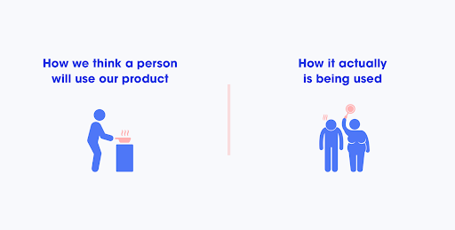

An important point to note is that there is a difference between user testing and usability testing:

User testing is about going to your end users and asking them: If I built this solution for this problem that you’re facing, would you use it? Would you find it useful? Would it solve your problem?
However, with usability testing, you are actually placing the solution in front of the user and saying “Use it”. You want the user to actually engage with your solution to see if it really does solve their problem or not.

The problem with user testing is that without actually using the solution, the feedback from the user isn’t certain - it’s based on conjecture; “well, if the solution worked like this, and I could use it in this situation, then yeah I think I would use it”. This type of feedback is much less valuable than “I have used this solution and I think it solves my needs perfectly” which we gather from usability testing.

Think about it like this: If you are in two scenarios, one in which you are told to plan on how you would spend R1m, and one in which you got given R1m and are then asked to spend it, which scenario would best indicate how you spend R1m? Well, the scenario where you actually get the money and we can watch you spend it of course. We all know that when given a hypothetical scenario like being given R1m we tend to give answers that are more objectively agreed upon - like giving 10% of the money to charity. However, once we have the money, the chances of us just giving away 10% is much less. What we say vs what we do as humans is never the same; it is much easier to say something than to do it. How many people have you heard say “yeah I can do that!” and then struggle to actually do it?

***Sure I can grow an amazing beard!***

### HOW TO TEST
The way in which you test will depend on the type of prototype you have developed. If you have designed a simple sketch wireframe to first use as a test, then you will have a lot more of the ‘hypothesised’ user feedback. If the user only has a hand drawn website to look at, then they can only tell you how they might use it - “this looks confusing”, "this looks interesting”, “I wouldn't know to click here”, “does this button take me back?”, etc.

However, if we have a real working mock-up for the user to use, we can get feedback like “I couldn’t click on this”, “I got stuck at this step”, or “I wanted to go here but I couldn't because of this” etc. So depending on the type of prototype you have depends on if you can do user testing or usability testing.

How we intend our product to be used vs how our users use it

### Usability Testing
If you have a high-fidelity prototype, something like a mockup that has clickable linked wireframes, then you can engage in usability testing easily. What you’ll do is:

**Test**
   
   - Sit your user down in a quiet room

   - Introduce the prototype to them and explain what their objective/task is

   - “We want you to go from point A to B”, or “We want you to purchase an item”
   
   - Sit back and keep quiet; do not help the user even if they ask

   - Document where the user is struggling as this is the feedback you are looking for.

   - Jot down where they asked their question

   - Take note of the question itself

   - Take note of where the user struggles but didn’t ask for help

   - Document how long the user struggled at each point in the journey

**Interview**

Once the user has finished with their task, you can then engage with them:

   - Explain to them the thinking behind certain problem areas and listen for their feedback 
   - do they agree now that they understand? Are they still confused? Do they understand but disagree with your assumptions on how it would be used?

   - Ask specific questions on things you want to know from them:

     - Do you know what this is?

     - Would you know to click on this if you needed to get here?

     - Did this confuse you?

     - What would you change?

     - What can be improved?

   - Ask the user for any suggestions or recommendations

### USER TESTING

If you are doing user testing, the easiest and best way to do this is to try and mimic usability testing first. Give the user the low-fidelity prototype and follow the test process listed above.
However, the real testing will come in the interview stage. Because the prototype has much uncertainty and the user can’t actually use it, the most value you will get is in interviewing the user.
Additionally, if you only have sketches to show and you happen to have multiple versions of the solution, then you can test out all of them with the user. Let them engage with the first one and gather feedback, then introduce the second, and so on.

**FOCUS GROUP**
You can also use focus groups to get user feedback. You’ll need to gather up a group of users, either from the same persona type or from different personas, and sit them together in a room. You’ll then present the idea to them and they can either each go through it individually first, or you can take them through it as a group. Once you’ve done so, you will then allow them to have a discussion and discuss their experience with the solution. The idea then is to get all of their feedback as a group; you want a conversation to take place.

The benefit of using focus groups is that it allows certain people in the group a chance to speak up and share their thoughts when they hear other people sharing similar thoughts. Listening to others can trigger certain thoughts that you wouldn't have had normally.

The issue however with focus groups is that sometimes it’s only the loudest voices in the room that speak up, and other shy people are less likely to share their thoughts. The problem is that you may miss out on great feedback from people who are keeping quiet.

**SURVEYS/QUESTIONNAIRES**
You can also use surveys or questionnaires to gather feedback. If you have users who are located far away from you and you cannot meet with them, then you can send them the prototype and attach a survey for them to fill out.

Below is an example template for gathering feedback.

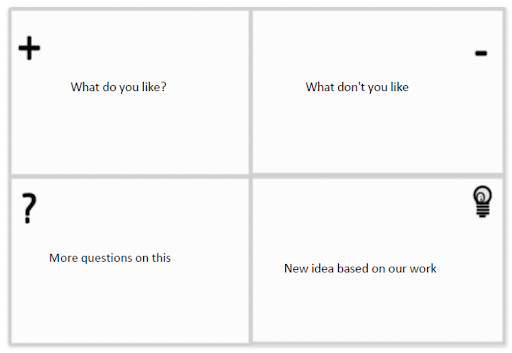

**A/B TESTING**
A variation in your testing, rather than a new method, a/b split testing allows you to test multiple solutions with your users. This can be done in two ways:
offer the user two variances of your prototype and ask them to use both and then choose which they prefer.
Offer one prototype to one user group and the other to a different set of users. By splitting your user group in two, you can get unbiased data as to which prototype performs better. Ensure that you split your user group up evenly.

***GUIDELINES***

A few things to consider when testing:
 - Be Impartial
 
  - You do not want to become protective of your idea and get defensive if people state problems with it. Remain calm and remember that you are trying to get constructive criticism on how to make your solution better for your user. It may be hard to take the feedback, but it’s only going to make you and your product better.

 - Be Flexible
  - If your user suggests something that could be a great fix to your solution, then go about a thought experiment with them to engage their solution and think with them on how it would work. This only works if you can maintain your impartiality.

 - Let the User contribute
 - 
  - Allow your user to express ideas and changes. You may not agree with any or all of them, however, it makes your user feel like they are being engaged and useful which should mean they will give more meaningful and useful feedback to you.

 - Present the Idea and task neutrally

  - Along with being impartial is how you present the idea. Make sure you don’t present the idea in a way that the user will feel bad if they give feedback. Don’t say “This is my awesome perfect amazing solution that I know will make your life better”. Rather say “The team has come up with this solution and we want to know if it’s something that will be used and be useful for you”.

 - Ask lots of questions
  - The key to testing is in the questions you ask the user. Make sure that you have a strong list of questions already devised before you begin, and be open to asking new questions that may arise as you go through the process.
  - Vary your questions:
  
   - You can ask specific functional questions like: How did this work or did you know to click on that button
  
  - You can ask non-functional questions like: How did this look? What feelings did you feel when you read this? How did the colour scheme make you feel?

 - Let the User guide the feedback

  - Don’t instruct or direct the user when they give feedback; allow them to express themselves as freely as possible. A lot of the time, people only get the real meaty feedback once they have opened up and spoken about some smaller issues first. Give the user the floor to speak their mind.

 - Design a questionnaire
  
  - To be impartial, you can design a questionnaire that the user can fill in after they have tested the solution. This allows you to be more systematic when gathering feedback and also allows for easier quantitative data analysis, as the interview questions you ask may be more qualitative.

 - Involve external observers

  - You can invite someone from outside of your team to assist with asking questions or for taking down feedback. The benefit is that you know they will be more impartial than you would be.

 - Don’t listen to your users

  - Huh? Don’t? Well...yes, sort of. What you want to avoid doing is listening to user feedback that is misguided or irrelevant. You of course want to listen and respond to what your users say, but sometimes they may say things that are just wrong (remember the differentiation between bad and wrong ideas? The same applies here).

  - Imagine you were testing an idea to solve an issue for ‘users who love the beach but hate having sand in their shoes after the beach’. Upon testing your solution, the user says “yeah it’s great, I like it, but wouldn’t it be easier to just not even go to the beach?”. In this case, the feedback goes against the initial problem statement - the problem is that people who do want to go to the beach hate having sand in their shoes when they leave; by suggesting that users rather avoid the beach, we are not adhering to the problem and the correct user group. 

Don’t forget why you are testing! You want to ensure that the solution you design for your user is one that your user will use.

***RECORD TESTS***

As stated above, you need to document the user feedback that you receive. What is the point of asking people what they think if you aren't going to hear and listen to them? You need to be collecting all feedback that the user gives you, even if you think it is silly or unnecessary. You may find another team member thinks it’s very valuable or you may realise later that 80% of your users said the same thing.

By documenting your findings, you can come back to decipher them and find insights embedded within them. You want to look for root causes here; you want to understand why your user struggled with something or didn’t see something that was important.

You can do this in various ways, however, the software development practice of grouping feedback into things like ‘feature request’ or ‘bug’ is a great way to go about it. What you want to be doing is taking each piece of feedback and categorising it. Once categorised, you can then prioritise the issues and plan how you aim to resolve them.

Additionally, you can also use cameras to help record the user and their experience. This can be used as both a data collection method and a data recording method.

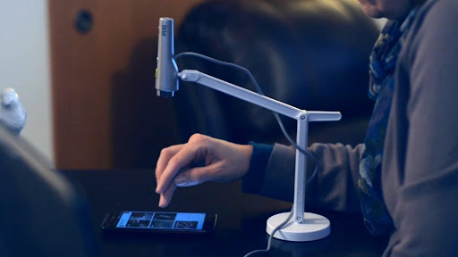

The below gives you an idea of how you could categorise the feedback, however the method you choose to use is up to you:

 - Feature Change: This is a change that must occur on a feature of the product
  
  - E.g. We didn’t expect the user to want to place more than one item in their shopping cart, and now the program has been written to only allow one item. To fix this, we must change the feature so that the user can add more than one item.

 - Bug: This is an issue in the way the program/product works; it’s how the product isn’t working vs how it was intended to work.

  - E.g. If we had initially intended for the shopping cart to allow more than one item and we coded it that way, and now it doesn’t work that way, then it is a bug that must be fixed.

 - Feature Request: This is a new piece of functionality that the user is requesting.

  - E.g. The user wants to be able to log in and save their shopping data so that they can return later. We did not build the solution to have a login, so now we need to assess this request and decide if we should action it.

  - As you can see, it’s sometimes hard to find the difference between bug/change/request; however, hopefully, you see that a change is something small to existing functionality, and a bug is an issue with the way the current functionality works, and a request is an entirely new piece of functionality.

 - UX/UI Issues: This is an issue the user has with the way the product looks and feels

  - E.g. The user was unable to see the blue button as it was placed on a blue background. Or, the users we are serving are the elderly, and the text on our site is too small which means it’s difficult for them to read it.

By similarly categorising your feedback to the above list you’ll find it much easier to analyse the data. You’ll have X feature changes, Y bugs, and Z UX/UI issues.
If you can see there are an overwhelming number of bugs, then you’ll likely want to treat some of them first by adding or changing features. However, if you have a bug on a feature that is going to change, then you don’t want to fix it before you change it - you’ll just be making double the work for yourself. What you need to do is prioritise and ‘code’ your feedback.

 
- On each feedback, write an acronym on the front of it that states where or what part of the product it affects.

  - E.g “Checkout”/”ChkOut” - This is for anything related to checking out your chosen items

  - E.g “LogIn” - This is for any feedback related to the login screen of your application.

 - Then add a column that lets you rank each issue.
  
  - Decide on a points scale: 1-5 works best; where 5 is the most important.

  - Rank each feedback issue based on its importance to the user

   - Can the user survive without this feature for now? Does this bug break the entire system or just a small unimportant part?

 - If you find that you have:

  - 3 bugs for the LogIn

   - 2 bugs ranked 5

   - 1 is ranked 2.

  - 1 feature change for the page
   - Ranked 5
  - You’ll need to look at the two priority bugs and your feature change to decide on what order they must be done to avoid duplicating work.

### IMPROVING PROTOTYPE & RE-TEST

Now that you have all this great feedback from your users, you will want to use that feedback to improve your prototype. There are no tricks or tips in this section, you simply need to head back to your original prototype and adjust it based on the features, issues, and bugs that you found when recording your user feedback.

Once you have updated your prototype to reflect all the important feedback, you then need to re-engage with testing. Simply head back to the testing phase and redo that testing now with the updated prototype.

You can run through this cycle as many times as needed, however, you may want to limit yourself otherwise you could run into time and money issues. Once you are satisfied with the results of your tests, you can conclude your testing phase.

## WHAT’S NEXT?
You have now run through the entirety of a design thinking process and have produced a solution that fits the original users' problems and has been tested as a viable solution for the user. Well done!

Next up, we will briefly look at how to start looking at implementing the solution you’ve tested. We will focus on pitching the implementation suggestions to the client and how to update your user journey/BPM to reflect the tested solution as it may have changed from your original proposed user journey when you pitched the idea to the client at the end of ideation.

## ADDITIONAL RESOURCES

### VIDEOS:

[Design Thinking: Prototype](https://youtu.be/Q4MzT2MEDHA)
[Design Thinking:Test](https://youtu.be/UVEQCNM6X-A)

### ARTICLES: 

https://www.uxpin.com/studio/blog/what-is-a-prototype-a-guide-to-functional-ux/

https://www.usability.gov/how-to-and-tools/methods/prototyping.html

https://www.interaction-design.org/literature/article/design-thinking-get-started-with-prototyping

https://it.toolbox.com/blogs/craigborysowich/prototyping-types-of-prototypes-030607

https://www.entrepreneur.com/article/308724

https://www.interaction-design.org/literature/article/stage-4-in-the-design-thinking-process-prototype

http://knowwithoutborders.org/unpacking-design-thinking-prototype/

https://www.interaction-design.org/literature/article/prototyping-learn-eight-common-methods-and-best-practices

https://www.interaction-design.org/literature/article/test-your-prototypes-how-to-gather-feedback-and-maximise-learning

https://ux.stackexchange.com/questions/74862/the-most-appropriate-questions-to-get-quality-end-user-feedback-during-prototype

https://www.interaction-design.org/literature/article/stage-5-in-the-design-thinking-process-test