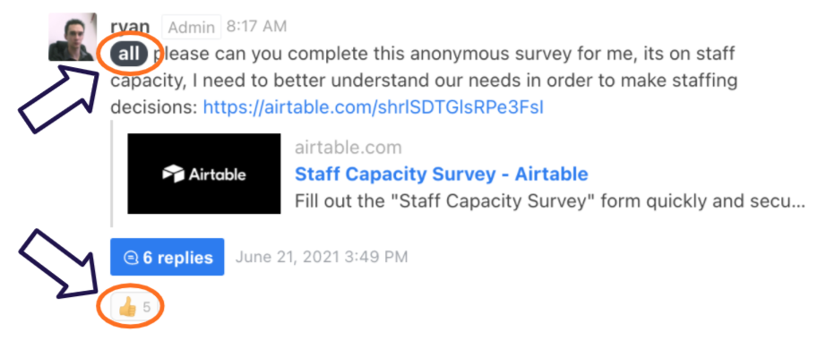
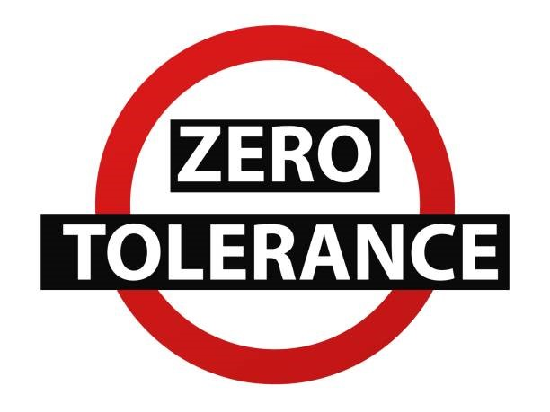
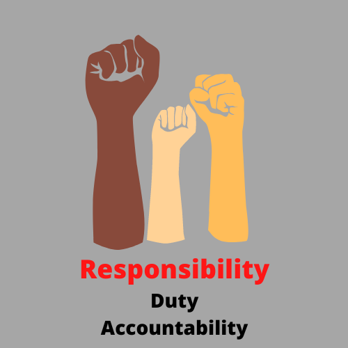
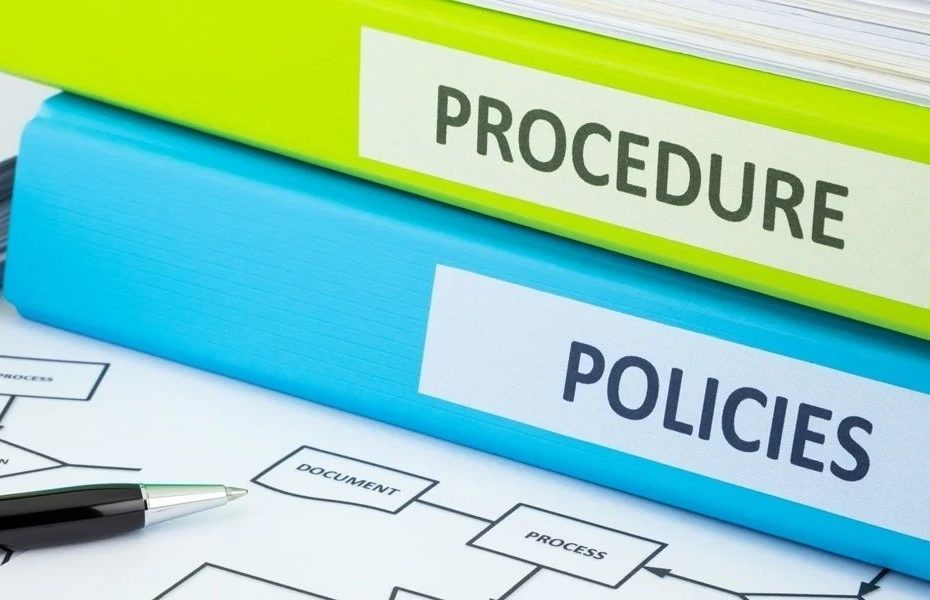

## **Vitual Work Guide**

The world of work has evolved tremendously since the start of the pandemic and many organisations, just like Umuzi, have had to adjust to being a remote training organisation. This has meant providing our learners the necessary support to ensure that learning and productivity are not interrupted. 
Below are a few guidelines to help you as you navigate the virtual world of learning and work!

## **STRUCTURING YOUR WORKDAY TO GET WORK DONE!**

**Your working hours**

The standard working hours at Umuzi are 08h30 - 17h30 with an hour lunch break every day. Although we are in no way clock watchers, we believe that having set hours of work gives one structure for the day, helps create boundaries that divide time for working and time for resting or living life, as well as to act as preparation for the workplace where these are the usual hours of work in many organisations. 

Now we understand that even in a virtual work environment, things happen! If any personal emergency arises, make sure to communicate with your main contact person, usually your Learner Support Manager, as soon as you can. We can’t offer the support you need if we don’t know what is happening. We’re just a quick call, WhatsApp text or email away.

**Some ideas to help you stay on track**

Keep some kind of diary - play around to see what kind of task management system works for you: digital, analogue, an app of some kind. Here are some free systems that we suggest experimenting with:

The [bullet journal](https://bulletjournal.com/pages/learn) method;

[Trello](https://trello.com/?&aceid=&adposition=&adgroup=105703213888&campaign=9843285526&creative=437184392305&device=c&keyword=trello&matchtype=e&network=g&placement=&ds_kids=p53016482445&ds_e=GOOGLE&ds_eid=700000001557344&ds_e1=GOOGLE&gclid=Cj0KCQjw7MGJBhD-ARIsAMZ0eeuu9gyMtuTDnrwTJoC5VXLNiabURwVThzFxDc-8pEreYrDnDFp8GVUaAiWYEALw_wcB&gclsrc=aw.ds) / [Asana](https://asana.com/?utm_source=unknown&utm_campaign=app.asana.com) / [Notion](https://www.notion.so/personal?utm_source=adwords&utm_campaign=14083469691&utm_medium=123977436423&utm_content=502429039670&utm_term=trello&targetid=kwd-3609071522&gclid=Cj0KCQjw7MGJBhD-ARIsAMZ0eetf-zkN_iRDIeXjEsaPGFzkImWk0uePPWOz_8Fn7u9M46OyQKvs7JYaAhyaEALw_wcB)

If you have Microsoft Office - To Do app (search for it to download it)

**How is your work environment set up?**

Now that we’re all working from home, it may be obvious, but you will require;

- A quiet area where you can focus on your work
- A background that is appropriate for professional meetings - your messy room and unmade bed are probably not going to leave the best impression ;) 
- A reliable internet and electricity connection as far as that is something that is under your control. If you know that where you live, the internet is unreliable and you frequently experience load shedding, then you are going to struggle to get your work done. It then becomes your responsibility to find an alternative workspace, where you can perform your duties. 

It is your responsibility to ensure that you have what you need to get your job done. 

## **COMMUNICATION**

The importance of mastering this soft essential skill for your own career success cannot be overstated. Different divisions and departments will communicate differently but there are some common themes that will take you a long way.

**Communication channels:**

Umuzi has various communication channels / platforms that we expect learners to stay on top of. These include:

Email

Rocket Chat

WhatsApp groups

To prevent you from constantly task switching, it may be a good idea to have set periods where you check comms e.g. first thing as you start work, at lunch and just before ending your day. This way, you can focus on getting work done instead of getting distracted by little noises every 5 seconds but the greatest delay someone will have in hearing from you will be max a couple of hours.

In general, a 24-hour response time to communications is considered professional best practice. While sometimes this is difficult, you should strive to achieve this as often as possible, even if it is just to acknowledge the communication and let your contact know you will revert with further feedback.

## **Acknowledging comms:**

If you receive a message or if there is a general comm that goes out and you are an intended recipient (e.g. someone who is meant to be receiving the comm) then you either need to reply to the message, where necessary, or react with an emoji - if that’s an established practice for your department.

This is to acknowledge that you’ve seen the message. For example:

Remember: should the message contain a task for you to complete - add that task to whatever task management system you’re using so that you remember to get it done!

## **Team communication:**

When it affects a team you might be part of for a project, communicate where the whole team can see it. Where possible, communicate challenges like loadshedding or connection issues on a public channel (e.g tech team RocketChat or WhatsApp) so that the whole team is aware of the issue and there is no broken telephone.

Other considerations:

- Try to organise stand-ins for duties you will not be able to perform
- When taking leave, communicate with your co-learners to organise stand-ins for events
- Communicate publicly who will be doing what so that the team is not in the dark and confused while you are away
- When you need help but don’t know who to ask, ask publically
- Your team members can tag someone that is able to help or offer help themselves
- If the issue is of a personal nature and you don’t feel comfortable posting to a public platform, then of course rather go straight to your LSM or line manager

**E-mails:**

You are in a professional, albeit learning, environment and as a result you need to use professional business language in your emails. Some guidance:
Keep it as short and to the point as possible - people stop reading when an email is longer than necessary.
Write in full sentences with full words. E.g. Text language is not OK.

**Phone calls:**

If this is something that is second nature to you and you’ve got it down, then great, if not, here are some guidelines:
If it’s a work-related call - which is what this document is addressing, then start by identifying yourself: “Hi, this is Anele from Umuzi” and then go into the details. 
We have diaries that are open for a reason: if possible, check to see that the person’s diary is open before calling or message to ask if they have time to chat at some point and ask what time works for them.

## **MEETINGS**

- Where possible, send your meeting request at least 1 day in advance
- Avoid double booking - everyone’s calendars are visible for this reason
- Respond to calendar invites as soon as you see them, so that others can plan their time effectively
- If you responded “yes” but something changes e.g. no electricity, let the meeting host know in advance that you can’t make it (and explain why)
- Check your calendar the night before or early in the morning to be able to plan your day effectively
- PREP for every meeting! If anything is sent to you in advance, go through it. If you know that the meeting will use some sort of tech e.g. Mural then make sure you have access etc.
- Ensure you have a working microphone so that you can join in on the discussion

**A word on your professional “brand”:**

- Out of sight, out of mind: if you’re wanting to accelerate your career, you need to be noticed. One way of doing this is by focusing on the fact that you are a professional brand. If you want to build your brand as someone who is a competent team player - then participate in the meetings you’re in! 
- If you can, turn your camera on: there are plenty of studies that say people trust you more when they can see you!

**Daily stand-ups:**

- Stand-ups are an important tool for us to communicate and coordinate. To have effective stand ups, it’s a good idea to:
- Prepare for your stand-up in advance, by the time you get to stand-up you should have a rough plan for your day prepared

Communicate what you need:

- Reviews
- Help
- Blockers

Communicate and take note of your colleagues’ plans

If your plans are going to collide, stand-up is the time to address this.

If you know you will be absent, send your plan in advance.

If you are unable to send it in advance, send it as soon as you come online

Your manager will make sure to communicate the order of priority different tasks that you’re involved in, however, if they don’t cover it, or you’re left unsure - ASK them:

- Where should I focus my attention first?
- What’s the max amount of time I should spend on this?

## **SOCIAL MEDIA**

Remote working has forced us to use various social media platforms to communicate with colleagues in real-time. Umuzi has several social media platforms which are used for a variety of work-related objectives. 

All our social media groups/channels are an extension of a professional work environment, so our conduct in these groups needs to reflect the level of professionalism required in a physical working environment. Here are things to note when conducting yourself on company groups/channels.

**Social Media Etiquette**

Remember to be considerate and respectful to others in your online conduct

Be polite and observe the same level of courtesy as you would do if you were speaking to someone face to face at work

Always keep to the purpose of the group. Do not spam the group, by sharing irrelevant messages about other topics, memes, or promotional deals

Try to only discuss work related matters in the group and use alternative groups or chats for personal discussions or organising out of work activities 

We all have our different beliefs, religions and opinions on the world - you can share yours in a respectful manner, but not in any way that seems forceful or as though your opinion / belief or religion is the only correct one to hold

Please do not share (Screenshots) or discuss (voice notes) confidential work with people outside of Umuzi (this includes names, issues / treatment details, especially anything relating to our Employer Partners)

Avoid one on one personal conversations, in the group. Switch to private messages

Refrain from arguments, heated opinions, fearmongering and fake news. Check your sources before you share.

Understand that the discussions will be moderated by the group admins/managers and any inappropriate activity may lead to further investigation and potential disciplinary.

**Time spent on social media platforms during work hours:**

Let’s face it, fun social media is an inescapable part of our everyday life. Whether your kryptonite is Instagram, TikTok or Facebook, we all plug in to social platforms for our personal use almost every day. Now that we are working remotely, we often have to engage these platforms for work purposes as well, which can cause us to run into unnecessary distractions which we sometimes can’t resist. We may find ourselves trapped in a mindless scrolling session on social media. That’s a chunk of work time you’ll need to make up for.

You need to be able to set boundaries that reflect the respect you have for your work. Here are some measures to put in place if you are struggling to get work done because you are easily distracted by social media.

1. Turn off your social network alerts and notifications
2. Close any news and livestreaming tabs
3. Close all social media tabs that aren’t work related
4. Log off all the social media apps on your phone that you gravitate towards when work gets challenging. If this doesn’t work, try no. 5.
5. Delete the app. Seems extreme, but if you just can’t resist the temptation, it may be worth it, while you pursue bigger goals at work.

If all else fails, try getting some assistance from these software programs: 

[Cold Turkey](https://getcoldturkey.com/)

[Freedom](https://freedom.to/?rfsn=1011885.qt02j4o&subid=kssbncn7vo00ypei058d6)

[RescueTime](https://www.rescuetime.com/)

[Momentum](https://momentumdash.com/) is a great chrome plugin that helps you to avoid all the pages that Google tries to lead you to. 

## **Ways to beat the sheds⚡:**

There is no denying the impact that load shedding has on everyone’s productivity and of course, connectivity. Ensuring that you are able to complete your tasks within the required time remains each learner’s responsibility as our programmes are time-sensitive and at times, collaborative, meaning that your delays in reviewing a peer’s work for example, can delay their overall progress.

To help remedy this as reasonably as possible, we’ve put together a few tips:

**Check your load shedding schedule**

Stay prepared so that you are not interrupted. The ESP (EskomSePush) app keeps you up to date with the load shedding stages we’re on as well as what time to expect an outage in your area. Remember to keep all of your devices charged before you have load shedding.

**Save your data where you can**

If you are able to buy data for the day or week, try not to use it excessively on social media when you still have power so that you are still able to continue learning during an outage. 

**Change locations**

A great way to beat load shedding is to find other places to work from that have power during outages. Check out your local library, a coffee shop if you can or if you have a friend or relative with a load shedding schedule different to yours, you can work at their place

**Communicate**

If you are unable to attend a check-in or stand-up session due to power outages, try your best to communicate with your LSM or line manager as soon as possible so that your absence is recorded and important information can still be communicated with you afterwards.

**Consider purchasing a UPS**

If you have wifi in your home or workspace, there is a nifty little tool called a UPS that can keep you online for a few hours during a power outage. There are lots of brands and price ranges on the market. It’s just a matter of finding one that works best for your needs and pocket. This  is one of the smaller and more reasonably priced ones on the market.

**RESOURCES**

If you’re eager to learn more and polish up those virtual work skills, here are some additional resources:
Open Classrooms Course: Learn to work autonomously - [link](https://openclassrooms.com/en/courses/5291566-learn-to-work-autonomously)

# **PRESENTATION OF SEXUAL EXPLOITATION AND ABUSE TRAINING (PSEA)**

## **REPORT IT, PREVENT IT, STOP IT**

Umuzi has a zero tolerance policy towards acts of sexual exploitation and abuse by all Umuzi representatives (including learners). All forms of sexual exploitation and abuse (SEA) are prohibited and constitute serious misconduct. These are therefore grounds for initiating disciplinary proceedings, which may ultimately lead to summary dismissal or termination of contract, and other serious measures in accordance with the legal framework applicable to the different categories of the Umuzi personnel. 

## **What is sexual exploitation and abuse?**

The abuse or attempted abuse of a position of vulnerability, differential power or trust for sexual purposes, including, but not limited to, profiting monetarily, socially or politically from the sexual exploitation of another. 
Similarly, the term “sexual abuse” means the actual or threatened physical intrusion of a sexual nature, whether by force or under unequal or coercive conditions.

## **What is sexual harassment?**

It is any unwelcome conduct of a sexual nature when such conduct interferes with work, is made a condition of employment or creates an intimidating, hostile or offensive work environment by an Umuzi representative against each other, or against any other individual.

**Sexual Harassment Conduct /Behaviour includes:**

**1. Physical Sexual harassment**

This is unwanted physical contact; touching, sexual assault, rape, or a strip search by or in the presence of the opposite sex.

**2. Verbal Sexual harassment**

This is unwanted innuendos, jokes, suggestions, hints, and improper sexual conversation. Sexual advances, comments with sexual overtones, and sex-related jokes are considered improper in a professional work environment and can cause offense and hurt. 

Insults or unwelcome graphical comments about a person’s body made in the presence of or directed toward a person is harassment. 

Unwelcome and inappropriate inquiries about a person’s sex life and sexuality, sexuality constitutes sexual harassment. Unwelcome whistling and catcalling directed at a person or group of persons constitute sexual harassment. 

**3. Non-verbal Sexual harassment**

This is unwelcomed gestures, indecent exposure, and the display of sexually explicit pictures and objects in the professional work environment are unacceptable and considered sexual harassment. 

Quid pro quo harassment occurs when an owner, employer, supervisor, member of  management, contracted consultant undertakes or attempts to influence the process of employment, promotion, training, discipline, dismissal, salary increment or other benefits of an employee, learner, or  job applicant in exchange for sexual favours. 

Sexual favouritism exists where a person who is in a position of authority rewards only those who respond to his/her sexual advances, whilst other deserving employees who do not submit themselves to any sexual advances are denied promotions, merit rating or salary increases. 

# **Key Responsibilities**

It is the responsibility of the Umuzi representative to report any person and to report incidences of sexual exploitation and abuse. 

Managers and others in leadership positions, in particular, are responsible for creating and maintaining an environment in which the Umuzi representatives are aware of the organisation’s expectations on prevention of sexual exploitation and abuse - either actual and/or suspected inappropriate behaviour. 

## **Procedures**

The Umuzi management and leadership have a duty to ensure that allegations of sexual exploitation and abuse are investigated and that appropriate disciplinary measures are taken.

The organisation also has a duty to provide appropriate assistance to any victims of sexual exploitation and abuse by the Umuzi representative. 

The organisation shall ensure that reports are investigated and handled in a manner whereby the identities of the persons involved are kept confidential, if necessary and as far as reasonably possible.

## **REPORTING AN INCIDENT**

**How do you tell someone?**

Anyone has the right to make a report about the behaviour of an Umuzi representative in line with our Code of Conduct, PSEA Policy and Whistleblower Policy. 
 
Please include as much information in your complaint, including:

All facts describing the alleged event, issue, or matter,

The name and title of each person involved,

Dates, times, frequency, and locations,

Facts relevant to urgency; and

Documentation, witnesses, or other evidence available to support the allegation, including any laws or policies believed to be breached

All sexual relationships between Umuzi representatives and learners on the organisation’s programmes are strongly discouraged as they are based on inherently unequal power dynamics. Such relationships undermine the credibility and integrity of the Umuzi organisations work.

If an Umuzi learner is subjected to engage in any sexual activities with a Umuzi representative, he/she must report this immediately to the People operations manager who liaises with the Managing Director and the Umuzi Disciplinary team to take actions against the Umuzi representative. 

The Head of People and Managing Director, together with the Chair of the Board of Trustees, will decide the appropriate steps which may include an investigation, disciplinary action, reporting to local authorities, supporting criminal prosecution; and referrals for support for victims/survivors.

Sensitive information related to incidents of sexual exploitation and abuse shall be shared only with law enforcement authorities, registered support service agents and relevant Umuzi representatives. 

## **REPORTING IN GOOD FAITH**

Reports should be made in good faith. If the allegation later proves to be untrue, you will not face repercussions if you reported in good faith.

**1. Good Faith**

Reporting in good faith means the report is made with honest and sincere intentions.

**2. False complaints**

The person who makes a complaint of sexual exploitation and abuse that they know to be false are themselves violating the Umuzi standards of conduct and may be subject to disciplinary proceedings or other administrative action.

**3. Anonymous reports**

You do not have to give your name when reporting a suspicion of sexual exploitation and abuse. Anonymous complaints will be treated just as seriously as non-anonymous complaints. If you decide to report anonymously, do provide sufficient details to allow for independent corroboration of the allegation. Otherwise, it may not be possible to investigate.

# **SCENARIOS EXAMPLES**

**SCENARIO 1**
Dimpho and Karabo are learners at Umuzi. They study the same course and are put into a group for an assignment. Dimpho becomes attracted to Karabo and starts to chat to him and eventually explicitly flirts with Karabo. Karabo, being aware of Dimpho’s attraction to him, respectfully informs her that he is not interested. This upsets Dimpho, and instead of accepting Karabo’s response she continues to flirt with him and send very suggestive pictures of her body while she starts a rumour that she and Karabo are a couple within the group. Karabo is upset about this however isn’t sure how to address this without disrupting the group assignment.
 
**HAS DIMPHO COMMITTED SEXUAL EXPLOITATION AND ABUSE?**

**ANSWER TO QUESTION : YES**

Dimpho has committed sexual exploitation and abuse in the following conduct:

The standards of conduct on sexual exploitation and abuse prohibit all Umuzi learners to engage unwanted innuendos, jokes, suggestions, hints and improper sexual conversation in public workspaces.

Unwelcome gestures, indecent exposure, and the display of sexually explicit pictures and objects in the professional work environment are unacceptable and considered sexual harassment.

 
**WHAT SHOULD KARABO DO?**

**Karabo must do the following:**

He should report it to the Learner Support manager who will liaise with the People Operations manager for complaint against Dimpho. The People Operations manager will alert the Head of People and Managing Director together with the Head of Learner Experience to decide the appropriate steps which may include an investigation, disciplinary action and more importantly referring Karabo to the designated Wellness support member for counselling.

The People Operations manager, along with the Head of Learner Experience, will come back to Karabo with the two options to resolve his complaint: either an attempt can be made to resolve the complaint in an informal way or a formal procedure (refer to the Umuzi PSEA Policy & Umuzi Disciplinary Procedures) can be sanctioned. 

**Please note that the Umuzi learner should be under no duress to accept either option.**

 
**SCENARIO 2**

Serge is part of a group assignment, which he looks forward to as he enjoys collaborating with his peers until a new learner, Curtis, joins at the last minute. 

Towards the end of the group meeting, Curtis has a tendency to talk & boost about his sex life and asks inappropriate questions to everyone including Serge. 

Serge confronts Curtis to stop with his inappropriate questions. This does not deter Curtis and he continues to aggressively ask and even insinuates Serge’s sexual orientation, making Serge feel embarrassed and angry.

**HAS CURTIS COMMITTED SEXUAL EXPLOITATION AND ABUSE?**

**ANSWER TO QUESTION : YES**

Curtis has committed sexual exploitation and abuse in the following conduct:
The standards of conduct on sexual exploitation and abuse prohibit all Umuzi learners in engaging unwelcome and inappropriate enquiries about a person’s sex life or sexuality as it constitutes sexual harassment.

Unwanted innuendos, jokes, suggestions, hints and improper sexual conversation in public workspaces. Sexual advances, comments with sexual overtones, and sex-related jokes are considered improper in a professional work environment and can cause offence and hurt.
 

**WHAT SHOULD SERGE DO?**

**Serge must do the following:**

He should report it to the Head of Learner Experience who will liaise with the People Operations manager for complaint against Curtis or he can go to the Umuzi Wellness site to the direct report form.

Either the People Operations manager will alert the Head of People and Managing Director and the Head of Learner Experience or a Wellness support member will reach Serge for counselling and will alert the Umuzi Disciplinary team. 

The Umuzi Disciplinary team together with the Head of People and Managing Director decide the appropriate steps which may include an investigation and disciplinary action.

The People Operations manager, along with the Head of Learner Experience, will come back to Serge with the two options to resolve his complaint: either an attempt can be made to resolve the complaint in an informal way or a formal procedure (refer to the Umuzi PSEA Policy & Umuzi Disciplinary Procedures) can be sanctioned. 

**Please note that the Umuzi learner should be under no duress to accept either option.**

 
## **Investigations and Disciplinary Action**

Umuzi will investigate allegations of sexual exploitation and abuse and will engage professional investigators as appropriate if needed. This may involve local authorities in the police and justice system. Investigations are key to inform appropriate action as well as to uphold the rights to justice for victims/survivors. The safety, consent and protection of the rights of the victim will be central in all processes Umuzi undertakes. This includes upholding the strictest confidentiality.

The Umuzi Disciplinary Team in concert with the Umuzi Wellness Team will take care that  during an investigation of a grievance of sexual harassment, that the aggrieved person is not  disadvantaged, and that the position of other parties is not prejudiced if the grievance is found to be unwarranted.

The range of disciplinary sanctions to which Umuzi representatives/learners are liable is clearly stated in the Umuzi Code of Conduct and Umuzi Disciplinary Procedures, and therein it is made clear that it is a disciplinary offence to victimise or retaliate against an representative/learner who in good faith lodges a grievance of sexual harassment.

 
## **Dispute Resolution**

Should a complaint of alleged sexual harassment not be satisfactorily resolved by Umuzi internal procedures described above and set out in full in the Umuzi Code of Conduct and Umuzi Disciplinary Procedure, either party may within 30 days of the dispute having arisen, refer the matter to the CCMA for conciliation in accordance with the provisions of section 135 of the Labour Relations Act, 1995. Should the dispute remain unresolved, either party may refer the dispute to the Labour Court within 30 days of receipt of the certificate issued by the commissioner in terms of section 135(5).

**Criminal and civil charges:**

A victim of sexual assault has the right to press separate criminal and/or civil charges against an alleged perpetrator, and the legal rights of the victim are in no way limited by Umuzi’s PSEA Policy in accordance with the Department of Labour’s issued Code of Good Practice.

**Malicious accusation of sexual harassment:**

In the event where all due process has been followed to investigate an allegation of sexual harassment, and it is for Umuzi that the allegation was made with defamatory intent, such a false accusation of sexual harassment will be dealt with as an instance of serious sexual harassment in and of itself, subject to the same disciplinary process put out for serious offences in Umuzi’s Disciplinary Procedures.

## **PROCEDURES  FOR SEXUAL HARASSMENT VICTIMS** 

**Advice & assistance**

Designated Umuzi Wellness Team members, line management, and Wellness Support Counsellors, whom complainants may approach for confidential advice and assistance, have appropriate skills and experience to be able to provide support and advice on a confidential basis. 

There are two options to resolve a problem relating to sexual harassment: either an attempt can be made to resolve the problem in an informal way or a formal procedure (refer to Umuzi Code of Conduct, PSEA Policy & Umuzi Disciplinary Procedures) can be sanctioned. 
The Umuzi learner should be under no duress to accept either option.

**Informal procedure**

An opportunity where the Umuzi representative/learner can explain to the person engaging in the unwanted conduct that the behaviour in question is not welcome, that it offends them or makes them uncomfortable, and that it interferes with their work might be sufficient for the parties involved to resolve the grievance amicably. 

If this informal approach has not provided a satisfactory outcome, if the case is severe, or if the conduct continues, it may be more appropriate to embark upon a formal procedure (refer to Umuzi Code of Conduct, PSEA Policy & Umuzi Disciplinary Procedure). Severe cases may include: persistent harassment, sexual assault, rape, a strip search, and quid pro quo harassment.

**Formal procedure**

Where a formal procedure has been chosen by the aggrieved, Umuzi’s Disciplinary Procedure for resolving the grievance is available and discussions with the Disciplinary Team should:

Specify with whom the Umuzi representative/learner should liaise in proceeding with their grievance

Make reference to time frames which allow the grievance to be dealt with expeditiously

Provide that if the case is not resolved satisfactorily, the issue can be dealt with in terms of the dispute procedures contained in item 2.3.2 of the Umuzi PSEA Policy

# **Victim Assistance**

The Umuzi Disciplinary team will ensure that victims are referred to and receive professional assistance, with the assistance of the Wellness team,  informed by their consent and needs and in line with local regulations and guidelines.

**Additional sick leave**

Where a complainant’s existing sick leave entitlement have been exhausted, Umuzi management would give due consideration to the granting of additional sick leave in cases of serious sexual harassment where the learner - on medical advice - requires trauma counselling.

## **Umuzi Helpful Links**

[PSEA Policy](https://docs.google.com/document/u/0/d/1R7jvU43fcG5T40XTsERFvNO5xkjaBO4csmuw4X4iFJQ/edit)

[Whistleblower Policy](https://docs.google.com/document/u/0/d/15Xyuta72Kr6W3R-bXtjAC8Tbb8jMaNR1YDWuHtBylWw/edit)

[Umuzi Code of Conduct](https://docs.google.com/document/u/0/d/1ei56CNKhGzOAey4a5-7uDafTw4uPUQePDr9ZxV20c4A/edit)

[Umuzi Staff Disciplinary Procedure](https://docs.google.com/document/u/0/d/1yde2oSq8ODsn_JTYI3Bql-iJM7WlQx6LJsOchdlTjfo/edit)

[Umuzi Wellness Site](https://sites.google.com/umuzi.org/umuziwellness/wellness-resources/prevention-of-sexual-abuse-and-exploitation)

[Report Here](https://docs.google.com/forms/d/e/1FAIpQLSfKRIDGIdnwXbbllaLVucr6nD2_nePy86sUwSgQvF68ZoTAiw/viewform)

[My Umuzi Site](https://sites.google.com/umuzi.org/umuzi-recruits-home/whats-news?authuser=1)

## **REPORT IT, PREVENT IT, STOP IT**

# **Umuzi Policies**

Every organisation has a set of policies and procedures that govern the behaviour of all stakeholders. Umuzi is no different. These policies create guidelines that ensure that this remains a healthy working and learning environment for both staff and learners.

Explore the policies below and read through them thoroughly. Feel free to contact Rivo, your LSM if you have any questions about any of the policies.

[Code of Conduct](https://docs.google.com/document/d/1P298TsR0PLN2lHaj1mfGpjanrwJsgy6ePlD28tZCy9Y/edit#heading=h.73zzpafoqvlx)

[Disciplinary Procedure](https://docs.google.com/document/d/1ROQVZFjmYi87ExbMlzPbdeKDD1U9k8fCE4qXO8zSC-M/edit)

[Social Media Policy](https://docs.google.com/document/d/1TNQMMRJwfVHPzOOL2xBw1f-pxwRpCcL7UdhqiIhCPeg/edit#heading=h.cr32l0rdpvyz)

[Leave Policy](https://docs.google.com/document/d/1UEcef4epcoNqbS0YtM9KjCu4Es_jdIphaQbk9B8Gy6U/edit)