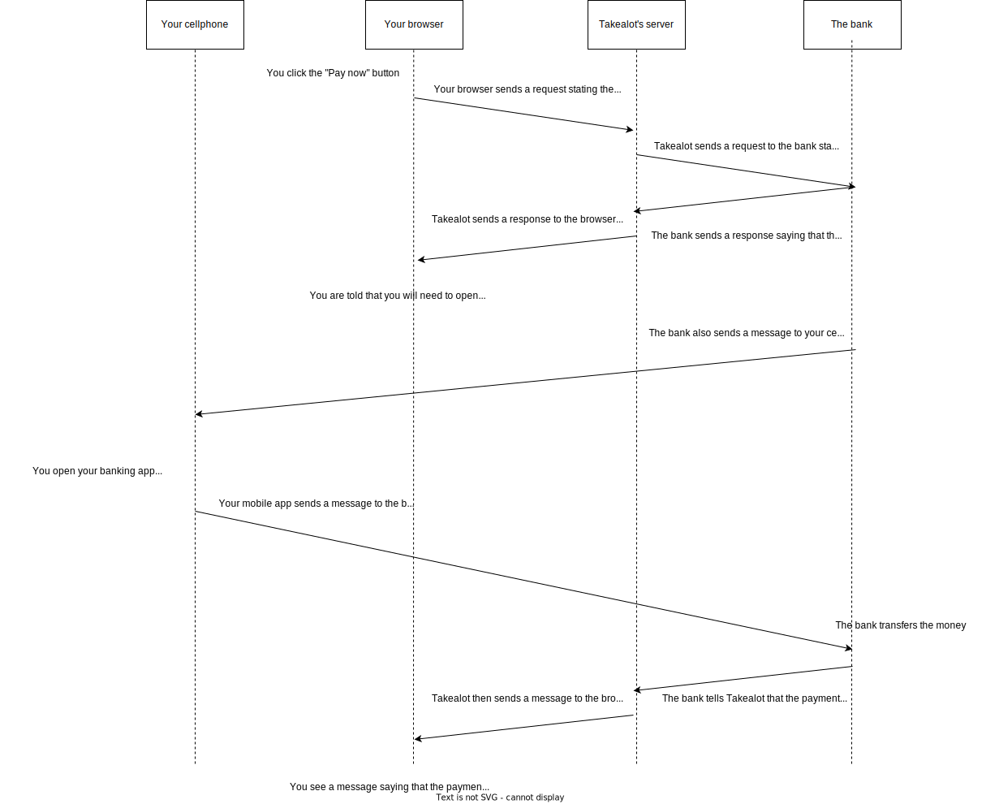

In the last part of this series, you learned a bit about authentication and authorization, and you learned that security is HARD. 

In this section we'll be going through the process of "checking out". 

At some point your shopping cart will be full of things that you want to buy. When you "check out" then you start the process of actually paying for your purchases.

## So you click the checkout button...

When you hit the "Checkout" button then you would start a multi-step process: You would need to confirm your order, choose how you want your things delivered, and set your delivery address.  This is achieved through normal page redirects and HTTP requests. 

Eventually you get to the last step in the payment process. You click a "pay now" button. You then see a message that asks you to open up your mobile banking app and approve the payment.

So you open up your banking app on your cellphone and log in there. The app asks you if you want to approve the payment, and you say yes.

When you look back at your web browser it shows a message saying that the payment was approved and that your order will be delivered. 

Note: The payment process might be different for different people, it depends on your bank and other choices. 

## What's going on here?

So Takealot is communicating with your mobile phone somehow. And when you click an "approve" button on your mobile phone then your web browser somehow knows that the payment worked... Can you think of how this can all be achieved given what you know?

**Think about it a little bit before you scroll down...**



## A few things to notice

This is a vast over simplification of the process. But it serves to demonstrate a few things:

### Servers can talk to other servers 

In the diagram above, Takealot's server is able to send messages to the Bank's server and vice versa. The messages they send to each other don't need to contain any HTML or CSS because the messages aren't meant to be directly viewed by humans. The messages just contain the information needed by the software running on the different machines.

This is an example of an API (Application Programming Interface). 

When Takealot sends a message to the bank to get the payment started it would be an HTTPS request, but that request can contain extra data. The data might look like this:

```
{
    cardNumber: 564841318...,
    paymentAmount: 11999,
    time: ...
    paymentReferenceForCustomer: ...
}
```

The bank's server would be programmed to take specific actions based on the information in the request.

### Cellphones can send and receive requests too

When the bank sends a message to your phone then it would be a lot like an HTTP request. In this case it's called a Push message. 

### Payments can be made safer with multiple forms of authentication

For the payment to go through in this case you would need to have:

- your Takealot username and password
- your cellphone
- your mobile banking app credentials (username and password, or a thumbprint)

## Lies!

We left out a lot of details in the diagram above. It's worth thinking about a little bit:

- How does the Takealot server authenticate with the bank? Or can any old server request payments to be made?
- What is the role of a payment gateway? Have you heard of those?
- How does the bank actually transfer the money? Is it a simple database update of something else?

## The end

That's the end of this story. We did cover quite a lot of ground and it might have seemed like a bit of a whirlwind tour to a lot of you.  It's a lot of new information.

If it's confusing then go and read up on the parts that you weren't sure of and then come back and re-read this story. With enough time you will understand it.